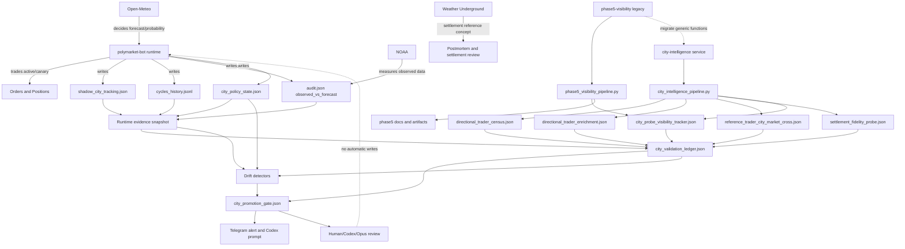

# System Architecture: polymarket-bot y city-intelligence

**Fecha:** 2026-04-10  
**Estado:** arquitectura canonica propuesta, corregida tras revision adversarial Opus (`GO WITH CHANGES`), sin implementacion  
**Alcance:** runtime `polymarket-bot`, capa analitica `city-intelligence`, rol objetivo de `phase5-visibility`

## Decision Ejecutiva

`polymarket-bot` debe seguir siendo la fuente de verdad operativa. Es el unico runtime que tradea, escanea mercados reales, aplica policy viva por ciudad y genera evidencia runtime como `shadow_city_tracking.json`, `cycles_history.jsonl`, `audit.json` y `city_policy_state.json`.

`city-intelligence` debe ser una capa analitica separada en cuanto a permisos de actuacion: puede leer y recomendar, pero no puede escribir policy ni ejecutar trading. La revision adversarial de Opus detecto que esa separacion ya esta incompleta en el plano de imports: `tools/city_validation_ledger.py` importa `bot` y consume constantes runtime. Por tanto, el documento no debe fingir desacople perfecto; debe tratar ese import como deuda arquitectonica explicita.

`city-intelligence` no puede producir ledgers ni gates de promocion usando una copia vacia o divergente del mundo runtime. Su contrato canonico debe ser: leer los artefactos runtime reales en modo read-only o fallar cerrado. Mientras no exista acceso runtime, debe decir `runtime_inputs_missing`, no producir ceros mudos.

`phase5-visibility` no debe tratarse como arquitectura core por defecto. Fue una capa experimental/legacy anterior a `city-intelligence`; conserva valor como trazabilidad y como prototipo de tracker/comparador de visibilidad, pero sus funciones vivas deben ser absorbidas por `city-intelligence` o quedar archivadas como historial metodologico.

## Correcciones Adversariales De Opus

Veredicto recibido: `GO WITH CHANGES`.

Cambios que esta arquitectura debe incorporar antes de considerarse canonica operativa:

1. `city-intelligence` no esta desacoplado de `bot.py`: `city_validation_ledger.py` usa constantes como `OBSERVED_AUDIT_KEY`, `RESOLUTION_ICAO`, `SHADOW_CANARY_MIN_EDGE_HITS` y `SHADOW_CANARY_MIN_CYCLES`. Opus detecto que ese import era top-level; el fail-closed v0 lo movio a import lazy despues del chequeo de runtime faltante. Aun asi, la dependencia de constantes sigue siendo deuda. El objetivo futuro es mover esas constantes a un contrato compartido o snapshot serializado, no depender del runtime completo.
2. El bug de Shanghai es plumbing antes que semantica: los inputs runtime faltan, `load_json(..., required=False)` devuelve `None`, `summarize_shadow_tracking()` convierte eso en `available=False` con ceros, y `build_city_row()` descarta `available`. Resultado: el ledger no distingue "archivo ausente" de "cero edges real".
3. `policy_mode` actual del ledger viene de `reference_trader_city_market_cross.json`, no de `city_policy_state.json`. Por tanto `analytics_policy_mode` y `runtime_policy_mode` son contratos futuros, no campos existentes.
4. El ledger actual itera solo `cross.city_rows`. Una ciudad solo-runtime puede omitirse aunque tenga evidencia en `shadow_city_tracking.json`. El modelo objetivo debe decidir si itera `cross ∪ runtime`; hasta entonces, omitir ciudades runtime es un fallo conocido.
5. `drift_flags`, `runtime_inputs_status`, `audit_runtime_drift` y estados similares son especificacion, no cableado existente. No deben describirse como detectores vivos hasta que `city_validation_ledger.py`, `city_promotion_gate.py` y alertas los consuman.

Primer cambio recomendado por Opus, todavia sin implementar:

- hacer que `city_validation_ledger.py` falle cerrado cuando falten inputs runtime en el servicio `city-intelligence`;
- propagar `runtime_inputs_status=missing`;
- hacer que el gate emita `gate_status=runtime_inputs_missing`;
- hacer que la alerta diaria diga que no puede concluir sobre ciudades runtime, en vez de repetir `edge_evidence=0`.

Correccion posterior al primer fail-closed:

- El chequeo v0 obligatorio cubre `shadow_city_tracking.json`, `audit.json` y `city_policy_state.json`.
- `cycles_history.jsonl` queda como input de auditoria/staleness posterior, no como requisito de disponibilidad v0. Esto evita bloquear un runtime nuevo o un volumen parcial cuando aun no se ha definido el detector de staleness.
- `city_validation_ledger.py` ya no importa `bot` antes de saber si faltan inputs runtime; si el runtime esta ausente, escribe fail-closed sin cargar el modulo.
- `city_intelligence_pipeline.py` debe dejar que `runtime_inputs_missing` prevalezca incluso si un paso externo previo produjo `partial_failure`.

## Arquitectura Actual Factual

### `polymarket-bot`

Servicio principal de produccion.

Responsabilidades actuales:

- escanear mercados de temperatura diaria en Polymarket;
- filtrar por ciudad, fecha, liquidez, precio y condicion;
- usar `Open-Meteo` para decidir;
- usar `NOAA` para medir;
- reconocer que `Weather Underground` es la fuente de resolucion final de Polymarket;
- ejecutar compras/ventas para ciudades `active` y `canary`;
- observar ciudades `shadow` sin capital;
- persistir artefactos runtime en su volumen `/app/data`.

Artefactos runtime canonicos:

- `shadow_city_tracking.json`: evidencia acumulada por ciudad; incluye agregados como `markets_seen`, `edge_hits`, `cycles_seen`, `best_edge_pct` y, conceptualmente, `directional_history`.
- `cycles_history.jsonl`: historial append-only de ciclos; permite auditar que ciudades se escanearon y que salio de cada scan.
- `audit.json`: capa de medicion, incluyendo filas NOAA en `observed_vs_forecast`.
- `city_policy_state.json`: overlay persistente de policy viva, incluyendo `auto_canary_cities`, `auto_shadow_cities`, `auto_blocked_cities` y transiciones.

Hallazgo live 2026-04-10:

- Shanghai si tiene evidencia en el runtime principal:
  - `markets_seen=84`
  - `edge_hits=19`
  - `cycles_seen=30`
  - `best_edge_pct=38.7`
  - `last_seen_at=2026-04-10T08:00:42Z`
- Shanghai figura en `auto_canary_cities` desde `2026-04-06T12:33:22Z`.
- Por tanto Shanghai no es un caso `shadow` puro en el runtime live.

Matiz critico:

- `directional_history` sigue vacio.
- Hay evidencia agregada de edges/ciclos por ciudad, pero falta base persistente resoluble contra NOAA para `WR observado direccional`.

### `city-intelligence`

Servicio analitico separado en Railway.

Responsabilidades actuales:

- ejecutar `tools/city_intelligence_pipeline.py` en horarios intradia;
- refrescar opcionalmente `settlement_fidelity_probe.json`;
- refrescar opcionalmente `directional_trader_census.json`;
- enriquecer traders direccionales;
- cruzar traders de referencia con ciudades y mercados;
- persistir visibilidad por ciudad;
- construir `city_validation_ledger.json`;
- construir `city_promotion_gate.json`;
- enviar alertas y resumen diario.

Pipeline actual:

1. `settlement_fidelity_probe.py` opcional
2. `directional_trader_census.py` opcional
3. `directional_trader_enrichment.py`
4. `reference_trader_city_market_cross.py`
5. `city_probe_visibility_tracker.py`
6. `city_validation_ledger.py`
7. `city_promotion_gate.py`
8. `city_intelligence_telegram_alert.py`

Defecto arquitectonico actual:

- `city-intelligence` corre en un volumen dedicado.
- `city_validation_ledger.py` importa `bot`; por tanto comparte constantes runtime por import, no por contrato versionado.
- Ese volumen contiene artefactos propios como `city_validation_ledger.json`, `city_promotion_gate.json`, `settlement_fidelity_probe.json`, `directional_trader_enrichment.json` y `reference_trader_city_market_cross.json`.
- Ese volumen no contiene los artefactos runtime del bot principal:
  - `shadow_city_tracking.json`
  - `cycles_history.jsonl`
  - `audit.json`
- `city_policy_state.json`
- `city_validation_ledger.py` apunta por defecto a `data/shadow_city_tracking.json` y `data/audit.json`.
- Si esos archivos no existen en el volumen de `city-intelligence`, el ledger cae a inputs vacios y puede reportar `edge_evidence=0`.
- `city_validation_ledger.py` no lee `city_policy_state.json`; el `policy_mode` de cada fila viene de `reference_trader_city_market_cross.json`.
- El ledger itera solo `cross.city_rows`; una ciudad que exista solo en runtime puede no aparecer en el ledger.
- `city_promotion_gate.py` no consume `runtime_inputs_status` ni `drift_flags` porque esos campos todavia no existen.

Consecuencia:

- `city-intelligence` puede decir que Shanghai no tiene evidencia propia mientras `polymarket-bot` ya acumulo `19` edge hits y la autopromovio a `canary`.
- El sistema produce dos ledgers semanticos: uno runtime y uno analitico, sin contrato de reconciliacion.
- El peor sintoma actual no es una recomendacion mala sino una ausencia de honestidad epistemica: el ledger no sabe decir "no tengo acceso al runtime".

### `phase5-visibility`

Servicio experimental/legacy separado, creado antes de consolidar `city-intelligence`.

Responsabilidades actuales/historicas:

- correr `tools/phase5_visibility_pipeline.py`;
- refrescar opcionalmente `settlement_fidelity_probe.py`;
- actualizar `city_probe_visibility_tracker.py`;
- producir snapshots especificos de Shanghai y Chicago;
- comparar `Shanghai` vs `Chicago`;
- enviar alerta one-shot si aparece visibilidad simultanea `Shanghai + Chicago`.

Pipeline:

1. `settlement_fidelity_probe.py` opcional
2. `city_probe_visibility_tracker.py`
3. `shanghai_shadow_test.py`
4. `chicago_active_benchmark.py`
5. `shanghai_vs_chicago_comparator.py`
6. `phase5_visibility_telegram_alert.py`

Lectura objetivo:

- No es core.
- No debe competir con `city-intelligence`.
- Es un prototipo util de visibilidad temporal y comparacion active-vs-shadow.
- Su rol objetivo es quedar archivado o absorbido por `city-intelligence`, no mantenerse como segundo plano decisional independiente.

## Arquitectura Objetivo

### Principio 1: una fuente de verdad por dominio

| Dominio | Fuente canonica | Consumidores |
| --- | --- | --- |
| Trading y ejecucion | `polymarket-bot` | dashboard, Telegram, auditorias, city-intelligence read-only |
| Policy viva por ciudad | `city_policy_state.json` + env allowlists/blocklists | bot, auditorias, city-intelligence |
| Evidencia runtime shadow/canary | `shadow_city_tracking.json` + `cycles_history.jsonl` | city-intelligence, drift detectors, dashboards |
| Medicion NOAA | `audit.json` / `observed_vs_forecast` | bot, city-intelligence, postmortems |
| Inteligencia externa de traders | `directional_trader_census.json`, `directional_trader_enrichment.json`, `reference_trader_city_market_cross.json` | city-intelligence |
| Gates analiticos | `city_validation_ledger.json`, `city_promotion_gate.json` | humanos/Codex/Opus, no bot automatico |
| Experimentos legacy | docs/data `phase5-*` | trazabilidad, migracion selectiva |

### Principio 2: `city-intelligence` no inventa runtime

`city-intelligence` puede clasificar, rankear y recomendar. No puede inferir ausencia de edge si no ha leido el snapshot runtime canonico.

Contrato:

- Si falta `runtime_snapshot` o faltan artefactos runtime obligatorios, el ledger debe marcar `runtime_inputs_status=missing`, no `edge_evidence=0`.
- En produccion, si `runtime_inputs_status=missing`, el ledger debe fallar cerrado: no debe emitir una cola de promocion normal ni una alerta que aparente conocimiento sobre Shanghai/Chicago/Seoul.
- Si `city_policy_state.json` dice `auto_canary`, el ledger debe reflejar `runtime_policy_mode=canary` aunque su cross analitico la vea como `shadow`.
- Si `shadow_city_tracking.json` tiene agregados y `directional_history=[]`, el ledger debe separar:
  - `runtime_edge_aggregates`: disponible;
  - `resolved_directional_history`: no disponible o vacio.
- Si una ciudad aparece en runtime pero no en `cross.city_rows`, la arquitectura objetivo debe incluirla como fila `runtime_only` o declarar explicitamente que queda fuera del ledger. La decision recomendada es `cross ∪ runtime` para no omitir evidencia runtime.

### Principio 3: promocion analitica no cambia policy

`city_promotion_gate.json` debe ser una cola de revision, no un actuador.

Permitido:

- `review_for_canary`
- `needs_shadow_validation`
- `observe_with_source_caution`
- `watch_closely`
- `use_as_benchmark`
- `audit_runtime_drift`
- `runtime_inputs_missing`
- `snapshot_stale`
- `audit_runtime_import`

No permitido:

- editar allowlists;
- escribir `city_policy_state.json`;
- tocar `bot.py`;
- mover ciudades entre `active`, `canary`, `shadow` o `blocked` automaticamente.

## Contratos Entre Servicios

### Contrato A: export runtime snapshot

Productor: `polymarket-bot` o wrapper read-only de auditoria.  
Consumidor: `city-intelligence`.

Decision recomendada tras revision Opus:

- Preferir montaje compartido read-only del volumen `/app/data` del bot principal para `city-intelligence`, si Railway lo permite de forma segura.
- No crear todavia un exporter dentro de `bot.py`.
- Contrato v0: `city-intelligence` lee archivos runtime literales en modo read-only y genera su propio metadata de lectura.
- Contrato v1 opcional: manifest/snapshot con metadata versionada. No mezclar wrapper con archivos literales sin adaptar consumidores.

Contenido minimo:

```json
{
  "generated_at": "2026-04-10T08:05:00Z",
  "source_service": "polymarket-bot",
  "source_deployment": "optional",
  "shadow_city_tracking": {
    "path": "/app/data/shadow_city_tracking.json",
    "available": true,
    "cities": {}
  },
  "city_policy_state": {
    "path": "/app/data/city_policy_state.json",
    "available": true,
    "auto_canary_cities": {},
    "auto_blocked_cities": {},
    "auto_shadow_cities": {}
  },
  "audit": {
    "path": "/app/data/audit.json",
    "available": true,
    "observed_vs_forecast_count": 0
  },
  "cycles_history": {
    "path": "/app/data/cycles_history.jsonl",
    "available": true,
    "latest_cycle_number": 0,
    "latest_cycle_at": ""
  }
}
```

Si se usa contrato v1 con manifest, el manifest debe incluir como minimo:

- `source_service`
- `source_deployment` o identificador equivalente si esta disponible;
- `snapshot_read_at`;
- `latest_cycle_at`;
- `latest_cycle_number`;
- `runtime_files_available`;
- `runtime_files_mtime` o hash por archivo.

El snapshot puede implementarse despues como:

- volumen compartido read-only, opcion preferida;
- job de copia controlada;
- comando Railway que exporta JSON;
- artefacto versionado fuera del volumen.

La decision de transporte recomendada queda cerrada en "volumen compartido read-only o equivalente". Si esa opcion no es viable, debe reabrirse la arquitectura antes de implementar exporters.

### Contrato B: ledger enriquecido

Productor: `city_validation_ledger.py`.  
Consumidor: `city_promotion_gate.py`, alertas, revisores.

Campos minimos por ciudad:

- `city`
- `analytics_policy_mode`
- `runtime_policy_mode`
- `runtime_inputs_status`
- `reference_traders`
- `visibility_evidence`
- `runtime_edge_aggregates`
- `resolved_directional_evidence`
- `noaa_evidence`
- `settlement_fidelity`
- `bottleneck`
- `evidence_status`
- `recommendation`
- `drift_flags`

Separacion obligatoria:

- `runtime_edge_aggregates.edge_hits` no equivale a `resolved_directional_count`.
- `noaa_rows` no equivale a settlement real.
- `runtime_policy_mode` no equivale necesariamente a policy analitica previa.

Comportamiento obligatorio cuando falta runtime:

- En produccion, si cualquier input runtime obligatorio falta, el ledger debe declarar `summary.runtime_inputs_status=missing`.
- Decision recomendada para el primer fix: emitir `cities=[]` y un resumen explicito de inputs faltantes, para evitar que filas analiticas parezcan evidencia completa.
- Alternativa aceptable despues de diseno: emitir filas con `evidence_status=unknown`, siempre que el gate y alertas propaguen `runtime_inputs_missing`.
- No aceptable: convertir `available=False` en contadores cero sin exponer la ausencia.
- En v0 pre-automation, si los runtime files existen pero `runtime_import_manifest.json` falta, no parsea o supera el umbral de edad, el ledger debe declarar `summary.runtime_inputs_status=stale`, emitir `cities=[]` y propagar `stale_runtime_inputs`. Un snapshot viejo no puede alimentar gates por ciudad.

Planos NOAA/source obligatorios:

- `noaa_rows`: cantidad de filas observadas disponibles.
- `noaa_gap`: magnitud de desviacion cuando exista.
- `settlement_fidelity`: score compuesto de metadatos de resolucion/fuentes; no equivale a settlement real.

Contrato de policy analitica:

- `analytics_policy_mode` debe tener productor definido. Hoy el valor viene de `reference_trader_city_market_cross.json` como `policy_mode`.
- Hasta que exista productor formal, nombrarlo `cross_policy_mode` en la arquitectura mental y no usarlo como si fuera runtime.

### Contrato C: promotion gate

Productor: `city_promotion_gate.py`.  
Consumidor: humano/Codex/Opus.

El gate debe responder:

- que ciudad requiere revision;
- por que;
- que evidencia falta;
- si hay drift runtime-vs-analitica;
- que lectura podria acercar a monetizacion sin tocar core.

Debe bloquear o degradar su confianza si:

- faltan inputs runtime;
- el snapshot runtime esta stale;
- hay divergencia de policy;
- `directional_history` esta vacio pero se intenta concluir WR observado;
- el censo externo esta degradado;
- el probe de mercados esta obsoleto.

Estados de gate obligatorios en arquitectura objetivo:

- `runtime_inputs_missing`: el servicio analitico no tiene acceso a los artefactos runtime obligatorios.
- `snapshot_stale`: existe snapshot runtime, pero no corresponde a un ciclo reciente.
- `audit_runtime_import`: hay que revisar plumbing/importacion antes de interpretar ciudades.
- `audit_runtime_drift`: runtime y analitica discrepan; aplica especialmente si runtime ya esta `canary/active` pero la analitica no lo refleja.

## Loops De Feedback

### Loop 1: runtime shadow -> canary

1. `polymarket-bot` detecta oportunidades fuera de ciudades `active`.
2. Persiste agregados en `shadow_city_tracking.json`.
3. La policy runtime puede autopromover a `auto_canary_cities` si se cumplen thresholds.
4. El bot empieza a tradear canary con sizing reducido.

Riesgo actual:

- este loop ya actuo sobre Shanghai, pero `city-intelligence` no lo vio.
- La auto-canary runtime usa agregados `edge_hits` suficientes para exploracion barata con sizing reducido, pero esos agregados no deben interpretarse como validacion observada ni WR direccional.

### Loop 2: runtime measurement -> forecast/policy audit

1. El bot guarda observado NOAA en `audit.json`.
2. Las auditorias miden cobertura, bias, MAE y calidad por ciudad.
3. Las decisiones futuras pueden revisar source fidelity o policy.

Riesgo actual:

- NOAA mide, no resuelve settlement. Confundirlo con resultado real produce decisiones falsas.

### Loop 3: external trader intelligence -> city candidate queue

1. `directional_trader_census.py` encuentra traders comparables.
2. `directional_trader_enrichment.py` clasifica calidad y actividad.
3. `reference_trader_city_market_cross.py` cruza traders con ciudades.
4. `city_validation_ledger.py` prioriza cuellos.
5. `city_promotion_gate.py` genera cola de revision.

Riesgo actual:

- si este loop no consume runtime, genera discovery interesante pero no sabe si el bot ya observo o promovio la ciudad.

### Loop 4: visibility tracking

1. `settlement_fidelity_probe.py` observa mercados direccionales activos.
2. `city_probe_visibility_tracker.py` acumula snapshots por ciudad.
3. El ledger usa visibilidad para distinguir `market_visibility` de otros cuellos.

Origen historico:

- este loop nacio en `phase5-visibility`.
- En arquitectura objetivo pertenece a `city-intelligence`.

### Loop 5: alertas y handoff

1. Gate detecta novedades.
2. Telegram resume el cuello dominante y el siguiente prompt para Codex.
3. Codex/Opus revisan evidencia y proponen siguiente paso.

Guardrail:

- alertas no son autorizacion de cambios en trading core.

## Drift Detectors Canonicos

### Detector 1: runtime input missing

Condicion:

- En fail-closed v0, `city-intelligence` no encuentra alguno de los tres inputs obligatorios: `shadow_city_tracking.json`, `audit.json` o `city_policy_state.json`.
- `cycles_history.jsonl` no es obligatorio en v0; se usara despues para staleness/auditoria de ciclos cuando exista transporte runtime.

Salida:

- `runtime_inputs_status=missing`
- `gate_status=runtime_inputs_missing` o `audit_runtime_import`
- prohibido reportar `edge_evidence=0` como ausencia real.

### Detector 2: policy divergence

Condicion:

- `runtime_policy_mode != analytics_policy_mode`.

Ejemplo:

- Shanghai runtime `auto_canary`, analitica la trata como `shadow` o ausente.

Salida:

- `drift_flags=["policy_divergence"]`
- gate debe priorizar auditoria de reconciliacion.

### Detector 3: aggregate-vs-resolvable divergence

Condicion:

- `shadow_edge_hits > 0` pero `resolved_directional_count == 0`.

Ejemplo:

- Shanghai tiene `edge_hits=19`, `directional_history=[]`.

Salida:

- `drift_flags=["edge_aggregates_without_resolvable_history"]`
- conclusion permitida: "hay evidencia runtime agregada".
- conclusion prohibida: "hay WR observado direccional".
- ruta sin tocar `bot.py`: backfill analitico desde `cycles_history.jsonl` + `audit.observed_vs_forecast`, si los campos de ciclos permiten reconstruir ciudad/fecha/lado/condicion/umbral.

### Detector 4: stale probe

Condicion:

- `settlement_fidelity_probe.json.generated_at` es viejo respecto al ciclo actual o al horario esperado.

Salida:

- `visibility_evidence.status=stale`
- el gate no debe promover por visibilidad sin refresh reciente.

### Detector 5: external trader input degraded

Condicion:

- `directional_trader_enrichment.summary.likely_input_degraded=true` o `quality_reference_traders=0`.

Salida:

- `bottleneck=trader_input_degraded`
- priorizar auditoria de input externo antes de city decisions.

### Detector 6: phase5 duplicate decision plane

Condicion:

- `phase5-visibility` produce alertas, comparadores o recomendaciones sobre las mismas ciudades que `city-intelligence`.

Salida:

- `drift_flags=["legacy_decision_plane_active"]`
- action: archivar o convertir output en input no decisional para `city-intelligence`.

## Rol Objetivo De `phase5-visibility`

### Funciones que siguen aportando valor

- `city_probe_visibility_tracker.py`: valor claro como acumulador temporal de visibilidad de mercados.
- `shanghai_vs_chicago_comparator.py`: valor metodologico como comparador active-vs-shadow, pero demasiado especifico.
- `phase5_visibility_telegram_alert.py`: valor como patron one-shot anti-spam, ya replicable por alertas de `city-intelligence`.
- `seed_data/phase5/*`: valor como bootstrap historico y trazabilidad de inputs iniciales.

### Funciones absorbidas por `city-intelligence`

- Tracking de visibilidad por ciudad.
- Uso de `settlement_fidelity_probe.py`.
- Alertas Telegram.
- Resumen de cuello dominante.
- Priorizacion de ciudades candidatas.
- Contraste entre ciudades shadow/canary/active.

### Recomendacion de rol

No mantener `phase5-visibility` como servicio separado a largo plazo.

Opcion canonica:

1. Congelar `phase5-visibility` como `legacy/experimental`.
2. Migrar sus piezas genericas a `city-intelligence`.
3. Mantener docs y artefactos por trazabilidad.
4. Apagar el servicio solo despues de confirmar que `city-intelligence` cubre:
   - visibilidad temporal;
   - comparacion contra benchmark active;
   - alerta one-shot;
   - historial minimo equivalente.
5. Verificar que queda un solo escritor vivo de `city_probe_visibility_tracker.json`; si `phase5-visibility` y `city-intelligence` escriben trackers en volumenes distintos, hay dos realidades paralelas.

### Artefactos/docs a conservar

- `docs/phase5-visibility-service.md`
- `docs/phase5-visibility-pipeline.md`
- `docs/phase5-visibility-telegram-alert.md`
- `docs/phase5_visibility_pipeline_latest.md`
- `docs/phase5_visibility_alert_latest.md`
- `data/phase5_visibility_pipeline.json`
- `data/phase5_visibility_alert_state.json`
- `seed_data/phase5/*`
- scripts `tools/phase5_visibility_*` hasta completar migracion o archivo formal.

### Riesgos de apagarlo ahora

- perder alerta one-shot de coincidencia `Shanghai + Chicago` si `city-intelligence` no tiene regla equivalente;
- perder continuidad de snapshots en el tracker si ambos servicios escriben/leen estados distintos;
- dejar vivo un scheduler legacy en otro volumen y creer erroneamente que fue apagado;
- borrar contexto historico sobre por que el cuello dominante era `market_visibility_and_selection`;
- confundir "servicio redundante" con "evidencia descartable";
- dejar sin comparador explicito la relacion entre una ciudad candidata y un benchmark `active`.

Conclusion:

- Apagarlo ahora no deberia afectar trading core.
- Si se apaga sin migracion, si puede degradar observabilidad experimental y trazabilidad.
- Su destino correcto es fusion funcional en `city-intelligence` y archivo documental, no eliminacion inmediata.

## Riesgos De Drift

| Riesgo | Causa | Impacto | Mitigacion |
| --- | --- | --- | --- |
| Ledger analitico vacio | Volumen separado sin artefactos runtime | Gates falsos | Runtime snapshot obligatorio |
| Policy divergente | Bot autopromueve, analitica no lo ve | Prompts incorrectos | Comparar `city_policy_state.json` |
| Edge mal interpretado | Agregados sin `directional_history` | WR observado falso | Separar agregados de resolucion |
| NOAA sobreinterpretado | NOAA usado como settlement | Diagnostico de PnL falso | Mantener contrato `NOAA mide`, `WU resuelve` |
| Doble servicio decisional | `phase5` y `city-intelligence` alertan distinto | Ruido operativo | Un solo gate canonico |
| Probe obsoleto | Refresh desactivado o fallido | Visibilidad vieja | Staleness detector |
| Censo externo estrecho/degradado | Slice de mercados o API | Trader discovery falso | Health checks y `census_markets=200` |

## Decisiones Abiertas

1. Confirmar viabilidad operativa de volumen compartido read-only en Railway para que `city-intelligence` lea `/app/data` del bot principal sin poder escribir.
2. Nombre y formato del snapshot canonico:
   - v0 recomendado: archivos runtime literales + metadata de lectura generada por `city-intelligence`;
   - v1 opcional: manifest `polymarket_bot_runtime_snapshot.json`.
3. Semantica final y productor de `analytics_policy_mode`; hoy el campo real es `cross.policy_mode`.
4. Que hacer cuando runtime autopromueve a `canary` pero `directional_history` sigue vacio; decision provisional: tratarlo como exploracion canary no como validacion observada.
5. Si la autopromocion runtime debe quedar como hecho consumado o requerir confirmacion analitica posterior.
6. Horizonte de staleness aceptable para `settlement_fidelity_probe.json`.

## Nota v0: policy divergence

En la reconciliacion v0, `city-intelligence` trata `runtime_policy_mode` como lectura read-only de la fuente runtime y conserva el valor procedente del cruce analitico como `cross_policy_mode`.

Decision deliberada de v0:

- si `runtime_policy_mode` existe y `cross_policy_mode` discrepa, el ledger emite `policy_divergence`;
- si `cross_policy_mode=unknown` y runtime conoce la ciudad, tambien se considera `policy_divergence` en v0 para fallar en voz alta;
- una iteracion posterior puede separar ese caso como `policy_cross_unknown`, pero no debe ocultarse antes de automatizar transporte;
- las filas `runtime_only` no son divergencia por si mismas: indican que runtime conoce una ciudad que el cross aun no cubre.
7. Momento exacto para apagar `phase5-visibility`.
8. Si los comparadores especificos `Shanghai/Chicago` deben generalizarse o conservarse solo como caso historico.
9. Si el ledger debe iterar `cross ∪ runtime`; recomendacion: si, pero no implementarlo hasta cerrar el contrato runtime.
10. Como eliminar o encapsular el `import bot` de `city_validation_ledger.py` sin duplicar constantes peligrosamente.

## Primer Cambio Futuro Recomendado

No implementar detectores completos todavia.

El primer cambio futuro, sin tocar `bot.py`, debe ser fail-closed en `city-intelligence`:

1. Detectar existencia de `shadow_city_tracking.json`, `audit.json` y `city_policy_state.json` en el volumen donde corre `city-intelligence`.
2. Si falta cualquiera, escribir un ledger con `summary.runtime_inputs_status=missing`, lista explicita de archivos faltantes y `cities=[]`.
3. Hacer que `city_promotion_gate.py` traduzca ese estado en `gate_status=runtime_inputs_missing` y `dominant_bottleneck=runtime_inputs_missing`.
4. Hacer que las alertas digan que `city-intelligence` no tiene acceso a runtime y no puede concluir sobre Shanghai.
5. Solo despues decidir transporte runtime: preferentemente volumen compartido read-only.

Lista de no implementar todavia:

- no tocar `bot.py`;
- no escribir `directional_history` desde runtime;
- no cambiar thresholds de auto-canary;
- no mover Shanghai entre modos;
- no escribir `city_policy_state.json` desde `city-intelligence`;
- no crear exporter dentro del bot antes de confirmar volumen compartido;
- no implementar los seis drift detectors antes de `runtime_inputs_status`;
- no apagar `phase5-visibility` hasta verificar volumenes/escritores y migrar la alerta one-shot;
- no generalizar comparadores Shanghai/Chicago todavia;
- no integrar Weather Underground como feed automatico.

## Diagrama Mermaid



## Prompt Para La Siguiente Revision

Antes de implementar, la siguiente revision debe responder:

- si el fail-closed propuesto es suficiente como primer cambio;
- si Railway puede montar el volumen runtime del bot en `city-intelligence` como read-only;
- si `city-intelligence` debe fallar cerrado cuando falte runtime;
- como representar Shanghai sin mentir: `runtime canary`, auditoria posterior, agregados reales, `directional_history empty`;
- que piezas de `phase5-visibility` migrar primero;
- que decision se puede tomar sin tocar `bot.py`.
